# YACCP Action

> Your gateway to the YACCP plugin ecosystem.

[](https://github.com/yaccp/yaccp)
[](https://claude.ai/code)
[](LICENSE)

**YACCP Action** is a Claude Code plugin that serves as the central hub for discovering, installing, updating, removing, and launching YACCP plugins. Think of it as your plugin manager for the YACCP ecosystem.

## Features

- **Browse Plugins** - Discover available YACCP plugins by category
- **Install Plugins** - One-click installation from the marketplace
- **Update Plugins** - Keep your plugins up to date
- **Remove Plugins** - Clean uninstallation of plugins
- **Launch Plugins** - Quick access to installed plugin commands

## Quick Start

### Installation

```bash
claude plugin add yaccp/claude-plugin-action
```

### Usage

```bash
# Open the YACCP Action hub
/yaccp-action:yaccp-action
```

## Command

| Command | Description |
|---------|-------------|
| `/yaccp-action:yaccp-action` | Open the plugin manager hub |

## Interactive Prompts

<details>
<summary><strong>/yaccp-action:yaccp-action</strong> - Main Menu</summary>

```
YACCP Action - Plugin Manager
=============================

What would you like to do?
● Browse plugins
○ Install a plugin
○ Update plugins
○ Remove a plugin
○ Launch a plugin
```
</details>

<details>
<summary><strong>Browse Plugins</strong></summary>

```
YACCP Plugins Marketplace
=========================

📦 Deployment
├── yaccp-aws-docusaurus (v1.1.19)
│   Deploy Docusaurus sites to AWS with S3, CloudFront
├── yaccp-aws-api-gateway (v1.1.0)
│   Deploy serverless REST/HTTP APIs with AWS Lambda
└── yaccp-aws-static-site (v1.0.0)
    Deploy static sites to AWS S3 + CloudFront

📋 Productivity
└── yaccp-roadmap-generator (v1.0.1)
    Create product roadmaps with Mermaid Gantt charts

Total: 4 plugins available
```

```
What would you like to do?
● Install one
○ View details
○ Back to menu
```
</details>

<details>
<summary><strong>Install a Plugin</strong></summary>

```
Which plugin would you like to install?
● yaccp-aws-docusaurus
○ yaccp-aws-api-gateway
○ yaccp-aws-static-site
○ yaccp-roadmap-generator
```

```
Plugin Installed!
=================

✓ yaccp-aws-docusaurus v1.1.19 installed

Available commands:
- /yaccp-aws-docusaurus:yaccp-aws-docusaurus-init
- /yaccp-aws-docusaurus:yaccp-aws-docusaurus-infra
- /yaccp-aws-docusaurus:yaccp-aws-docusaurus-deploy
- /yaccp-aws-docusaurus:yaccp-aws-docusaurus-status

To launch: /yaccp-action:yaccp-action → "Launch a plugin"
```
</details>

<details>
<summary><strong>Update Plugins</strong></summary>

```
Plugin Updates
==============

Checking for updates...

Plugin                    Installed    Available    Status
──────────────────────────────────────────────────────────
yaccp-aws-docusaurus      v1.1.18      v1.1.19      ⬆ Update
yaccp-roadmap-generator   v1.0.1       v1.0.1       ✓ Current
```

```
Which plugins would you like to update?
☑ yaccp-aws-docusaurus
☐ Update all
```
</details>

<details>
<summary><strong>Remove a Plugin</strong></summary>

```
Which plugin would you like to remove?
● yaccp-aws-docusaurus
○ yaccp-roadmap-generator
```

```
⚠️ Confirm Removal
==================

Are you sure you want to remove yaccp-aws-docusaurus?

This will:
• Remove all plugin commands
• Delete plugin configuration

● Yes, remove it
○ No, cancel
```
</details>

<details>
<summary><strong>Launch a Plugin</strong></summary>

```
Installed YACCP Plugins
=======================

1. yaccp-aws-docusaurus
   ├── yaccp-aws-docusaurus-init
   ├── yaccp-aws-docusaurus-infra
   ├── yaccp-aws-docusaurus-deploy
   └── yaccp-aws-docusaurus-status

2. yaccp-roadmap-generator
   ├── yaccp-roadmap-generator-init
   ├── yaccp-roadmap-generator-add
   └── yaccp-roadmap-generator-view
```

```
Which plugin would you like to launch?
● yaccp-aws-docusaurus
○ yaccp-roadmap-generator
```

```
Which command would you like to run?
● yaccp-aws-docusaurus-init
○ yaccp-aws-docusaurus-infra
○ yaccp-aws-docusaurus-deploy
○ yaccp-aws-docusaurus-status
```
</details>

## Architecture



## Workflow


## Available Plugins

YACCP Action connects to the [YACCP Marketplace](https://github.com/yaccp/marketplace) to fetch available plugins:

| Plugin | Category | Description |
|--------|----------|-------------|
| yaccp-aws-docusaurus | Deployment | Deploy Docusaurus sites to AWS |
| yaccp-aws-api-gateway | Deployment | Deploy serverless APIs to AWS |
| yaccp-aws-static-site | Deployment | Deploy static sites to AWS |
| yaccp-roadmap-generator | Productivity | Create product roadmaps |

## Troubleshooting

| Issue | Cause | Solution |
|-------|-------|----------|
| Cannot fetch marketplace | Network error | Check internet connection |
| Plugin not found | Not in marketplace | Check plugin name spelling |
| Install fails | Permissions | Run with appropriate permissions |
| Command not found | Plugin not installed | Install the plugin first |

## Contributing

Contributions are welcome! Please read [CONTRIBUTING.md](docs/CONTRIBUTING.md) for guidelines.

## License

Apache License 2.0 - see [LICENSE](LICENSE) for details.

## Author

Created by [Cyril Feraudet](https://github.com/feraudet) - A [Yaccp](https://github.com/yaccp) plugin for Claude Code.
